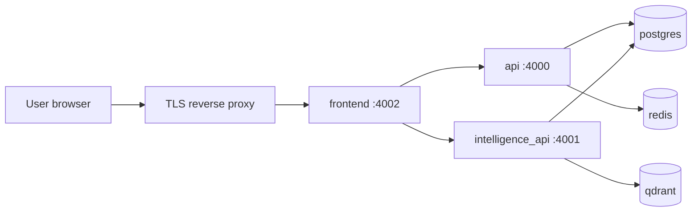

# Production deployment

This guide complements the ChamPeng local bootstrap (`scripts/bootstrap-champeng.sh`). Use it when exposing SentinelX beyond a trusted developer machine.

## Prerequisites

- Docker Engine 24+ with Compose v2
- TLS termination (Caddy, nginx, or cloud load balancer)
- Strong secrets in `.env` (never commit `.env`)

## Required secrets

| Variable | Purpose |
|----------|---------|
| `POSTGRES_PASSWORD` | Database password (not `sentinelx`) |
| `API_KEY` | Protects mutating API routes and WebSocket |
| `REDIS_PASSWORD` | Redis AUTH (required with prod compose override) |
| `QDRANT_API_KEY` | Qdrant API authentication |
| `HF_TOKEN` | Model download (if using SGLang profile) |
| `BRIGHT_DATA_API_KEY` | Optional scraping |

## Compose

```bash
cp .env.example .env
# Edit secrets, then:
docker compose -f docker-compose.yml -f docker-compose.prod.yml up -d --build
```

The production override:

- Removes host port bindings on Postgres, Redis, and Qdrant
- Enables Redis `requirepass`
- Sets Qdrant API key via environment
- Injects `SENTINELX_API_KEY` into the frontend container for server-side proxying

## Network layout



Only the frontend (and optionally the API docs port behind auth) should be reachable from the public internet.

## API authentication

When `API_KEY` is set:

- Send `X-API-Key` on mutating HTTP requests
- The Next.js app proxies `/api/backend/*` and `/api/intelligence/*` and injects the key from `SENTINELX_API_KEY` (server-only)
- WebSocket clients obtain a signed URL from `GET /api/realtime/ws-url` (includes `api_key` query param when configured)

Read endpoints remain open by default for dashboard data; tighten further with a reverse proxy if needed.

## Observability

- Prometheus metrics: `GET /metrics` on backend (`:4000`) and intelligence (`:4001`)
- Structured JSON logs from both Python services
- Optional: set `SENTRY_DSN` when Sentry integration is enabled in your environment

## Rollback

```bash
docker compose -f docker-compose.yml -f docker-compose.prod.yml down
# Restore previous image tags or volume snapshots as per your backup policy
```

## Verification checklist

- [ ] `curl -fsS https://your-host/health` (via proxy to backend or BFF)
- [ ] Dashboard loads at `https://your-host/dashboard`
- [ ] Signal detail: `GET /api/backend/agents/signals/{id}/detail` returns source + story
- [ ] Workspace page loads; `GET /workspace/profile` returns ChamPeng context
- [ ] `POST /sources` without API key returns 401 when `API_KEY` is set
- [ ] Postgres/Redis/Qdrant ports are not exposed on `0.0.0.0`
- [ ] TLS certificate is valid
- [ ] `SCRAPE_CACHE_HOURS=24` set to limit Bright Data usage on repeat scrapes
