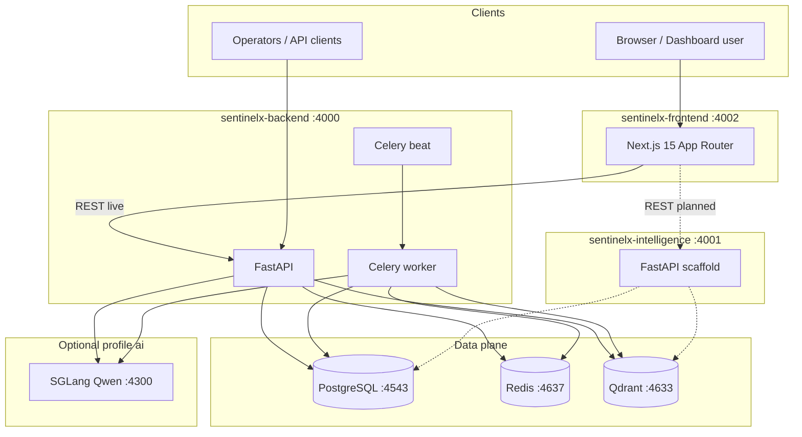
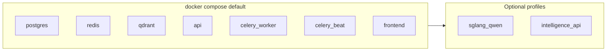
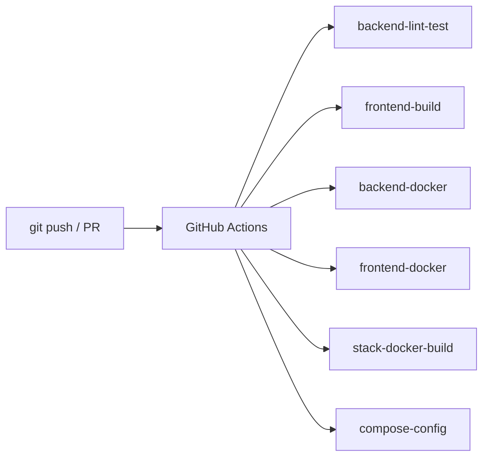

# Platform architecture

SentinelX is a monorepo with three application packages orchestrated by root `docker-compose.yml`.

## System context

## Port map (host)

| Port | Service |
|------|---------|
| 4000 | Backend API + OpenAPI `/docs` |
| 4001 | Intelligence API (profile `intelligence`) |
| 4002 | Frontend (Next.js) |
| 4300 | SGLang (profile `ai`, GPU) |
| 4543 | PostgreSQL |
| 4637 | Redis |
| 4633 | Qdrant |

## Deployment units

## CI/CD

See [.github/workflows/ci.yml](../.github/workflows/ci.yml).
