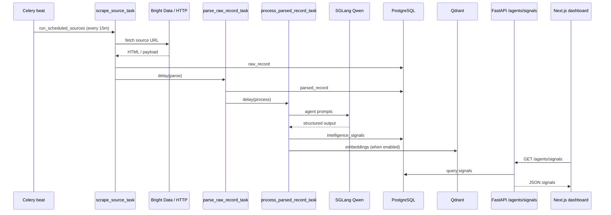
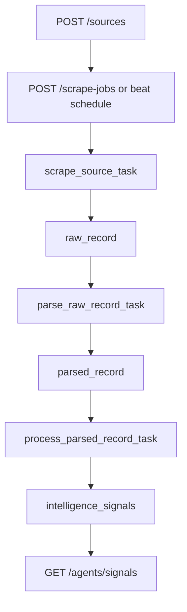
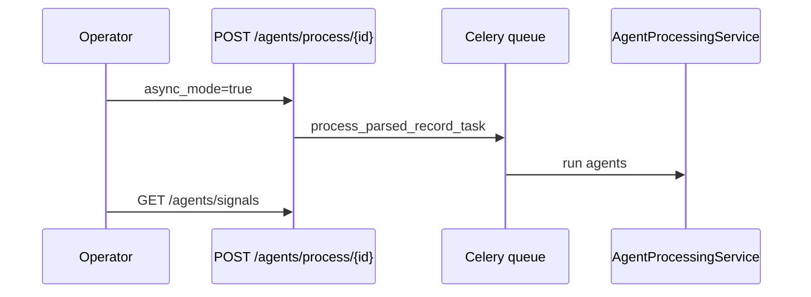
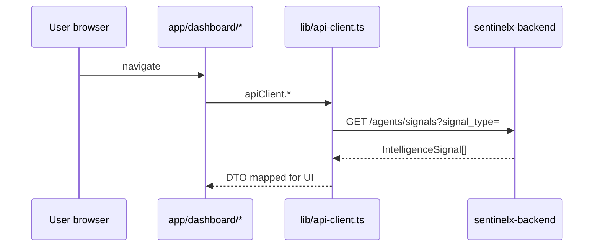
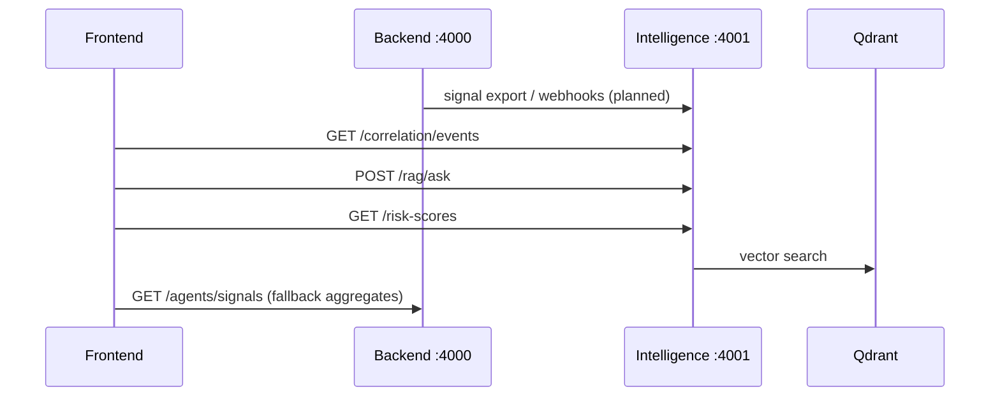
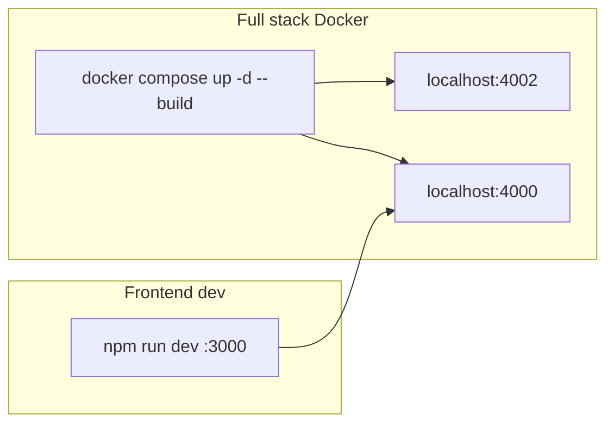
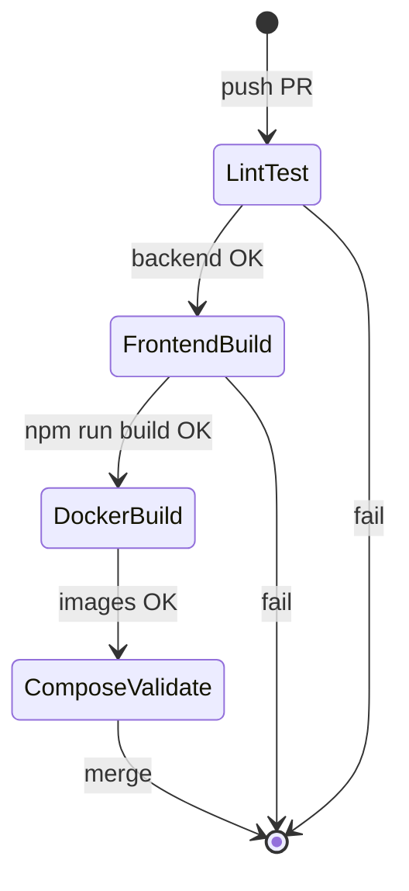

# Platform workflows

End-to-end flows across backend, intelligence (planned), and frontend.

## 1. Ingestion pipeline (implemented)

Source data enters through scraping and exits as intelligence signals consumed by the dashboard.

## 2. Operator API workflow

Manual reprocessing:

## 3. Dashboard read path (implemented)

## 4. Intelligence layer (planned)

When `sentinelx-intelligence` is deployed (`--profile intelligence`):

## 5. Local development workflow

## 6. Release / CI workflow

