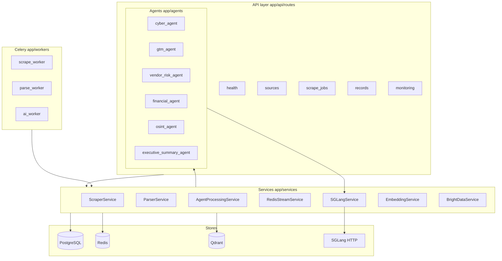
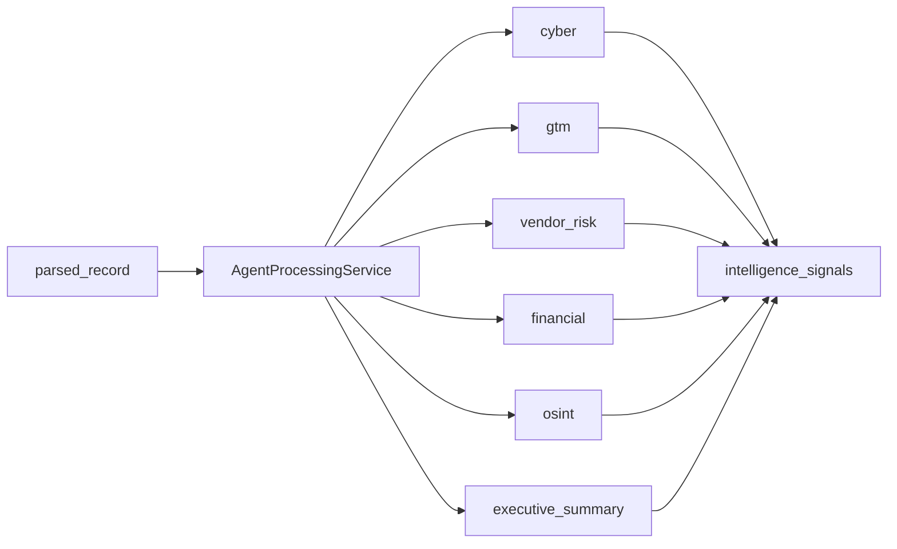

# Backend architecture

FastAPI application with Celery workers for async ingestion and Qwen/SGLang-powered intelligence agents.

## Layer diagram

## Directory layout

| Path | Responsibility |
|------|----------------|
| `app/main.py` | FastAPI app factory, router registration |
| `app/api/routes/` | HTTP handlers |
| `app/schemas/` | Pydantic request/response models |
| `app/db/models/` | SQLAlchemy ORM |
| `app/services/` | Business logic |
| `app/agents/` | LLM agent implementations |
| `app/workers/` | Celery tasks and beat schedule |
| `app/core/` | Config, logging, security |
| `alembic/` | Database migrations |

## Agent pipeline

Default agents (see `app/agents/__init__.py` → `DEFAULT_AGENTS`) run per parsed record:

## External dependencies

| Dependency | Env var | Usage |
|------------|---------|--------|
| PostgreSQL | `DATABASE_URL` | Sources, jobs, records, signals |
| Redis | `REDIS_URL`, `CELERY_*` | Broker, streams, cache |
| Qdrant | `QDRANT_URL` | Vector storage for RAG prep |
| SGLang | `SGLANG_BASE_URL`, `SGLANG_MODEL` | Qwen inference |
| Bright Data | `BRIGHT_DATA_*` | Managed scraping (optional) |

## Health surface

Aggregated dependency checks under `/health/*` — see [api-reference.md](api-reference.md).
