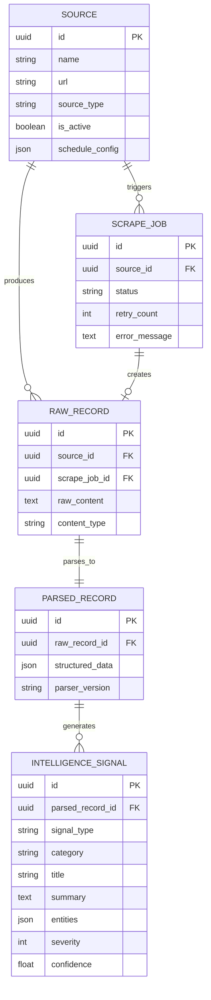

# Backend data model

PostgreSQL schema managed by Alembic. Primary entities for the ingestion pipeline.

## ER diagram

## Entity summary

| Model | Table | Purpose |
|-------|-------|---------|
| `Source` | `sources` | Crawl targets and schedule |
| `ScrapeJob` | `scrape_jobs` | Per-run scrape status |
| `RawRecord` | `raw_records` | Fetched HTML/payload |
| `ParsedRecord` | `parsed_records` | Structured extraction |
| `IntelligenceSignal` | `intelligence_signals` | Agent output for API/UI |

## Qdrant (vectors)

Embeddings stored in Qdrant collections via `EmbeddingService` — collection names and dimensions are defined in service code. Document collection changes here when implemented.

## Kai Zhe export

`GET /agents/signals/{id}/export` returns `KaiZheSignalExport` with joined source and parsed record context for the intelligence layer.
