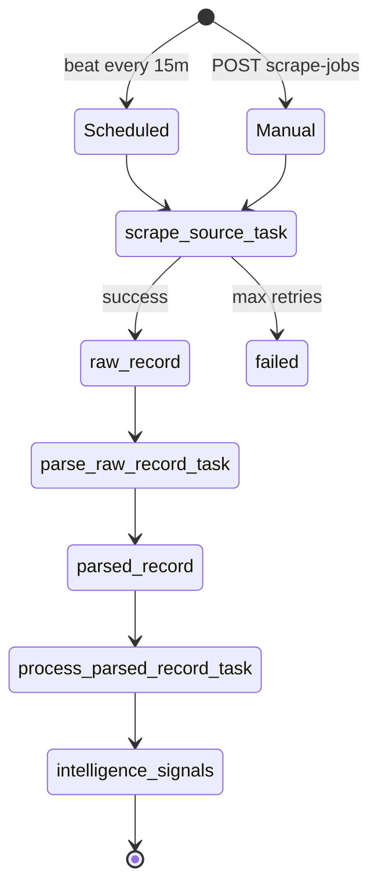
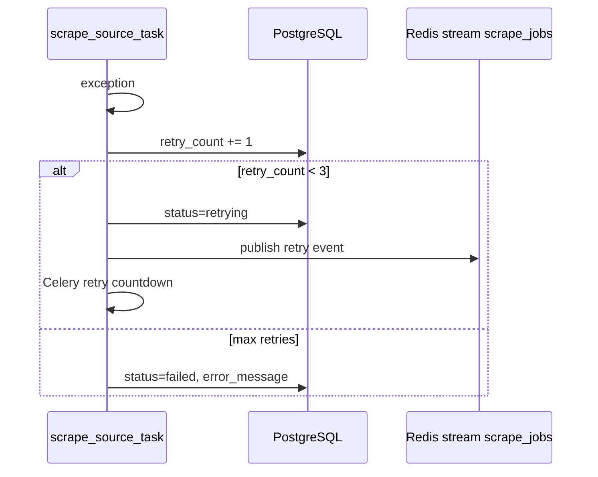
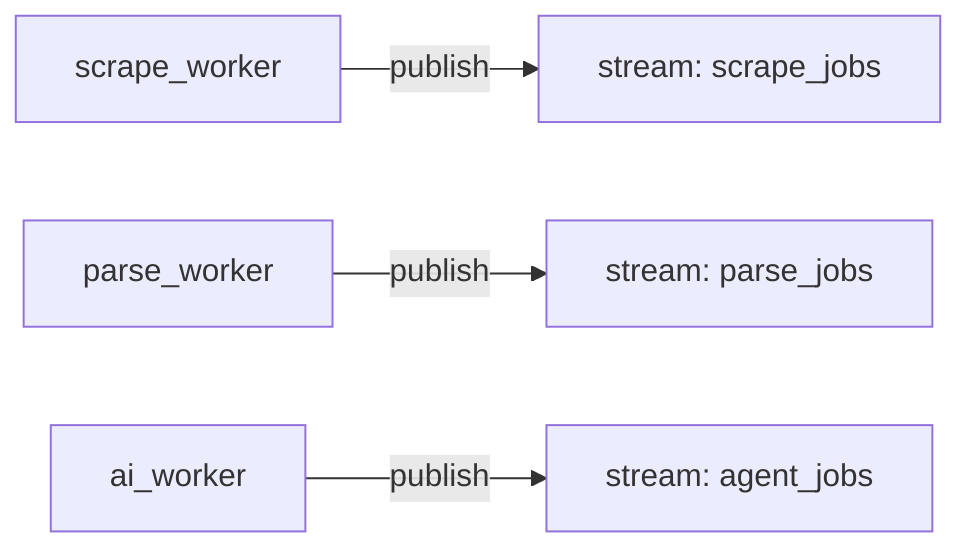
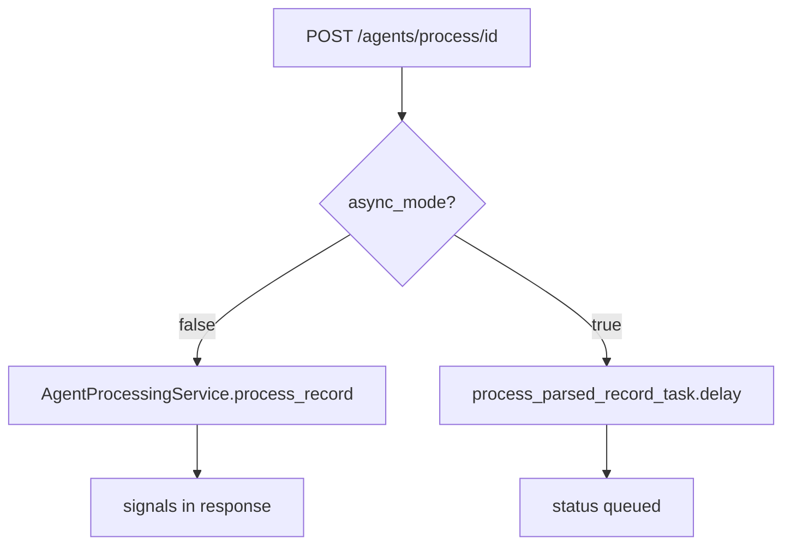
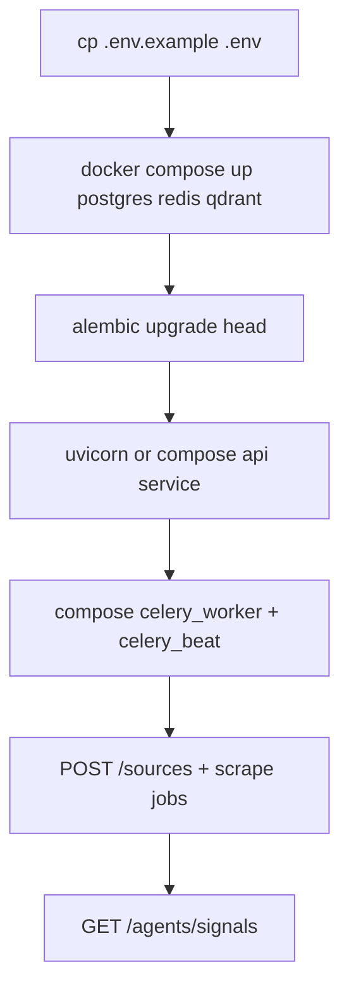

# Backend workflows

## Celery task chain



## Task reference

| Celery task | Module | Trigger |
|-------------|--------|---------|
| `scrape_source_task` | `scrape_worker` | Job created, beat schedule |
| `parse_raw_record_task` | `parse_worker` | After raw record saved |
| `process_parsed_record_task` | `ai_worker` | After parse completes |
| `run_scheduled_sources` | `scrape_worker` | Celery beat crontab `*/15` |

## Scrape retry workflow



## Redis streams (monitoring)

Operational events are published for observability. Inspect via `GET /monitoring/streams`.



## Agent processing (sync vs async)



## Database migration workflow

```bash
cd sentinelx-backend
alembic revision --autogenerate -m "description"
alembic upgrade head
```

CI runs `alembic upgrade head` before pytest.

## Local run workflow


