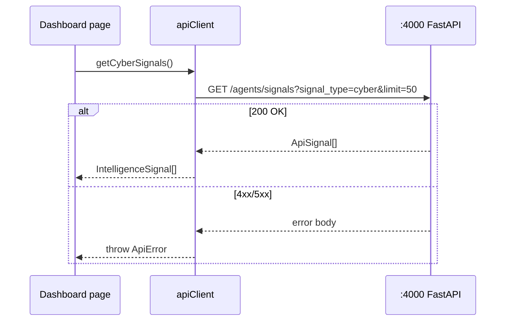

# Frontend API integration

Central client: `lib/api-client.ts`. All browser requests use `NEXT_PUBLIC_API_BASE_URL` (default `http://localhost:4000`).

## Environment variables

| Variable | Default | Used for |
|----------|---------|----------|
| `NEXT_PUBLIC_API_BASE_URL` | `http://localhost:4000` | Jay backend REST |
| `NEXT_PUBLIC_API_URL` | same as above | Alias fallback |
| `NEXT_PUBLIC_INTELLIGENCE_API_URL` | `http://localhost:4001` | Future Kai Zhe service |
| `NEXT_PUBLIC_WS_URL` | `ws://localhost:4000/ws` | Realtime (not live) |

## Implemented calls (backend :4000)

| `apiClient` method | HTTP | Path | Notes |
|--------------------|------|------|-------|
| `getHealth` | GET | `/health` | Connectivity check |
| `getSignals` | GET | `/agents/signals?limit=&signal_type=` | Core data |
| `getDashboardOverview` | — | aggregates `getSignals(100)` | Client-side metrics |
| `getCyberSignals` | GET | `/agents/signals?signal_type=cyber` | Threat feed |
| `getGtmSignals` | GET | `/agents/signals?signal_type=gtm` | Competitors |
| `getVendorSignals` | GET | `/agents/signals?signal_type=vendor_risk` | Vendor list |
| `getVendorSummary` | — | maps vendor signals to `RiskScore` | Vendors page |
| `getAlerts` | — | filters severity ≥ 6 | Alerts page |

## Planned / graceful fallback

| Method | Intended path | Fallback when 404/502 |
|--------|---------------|------------------------|
| `getCorrelatedEvents` | `GET /correlation/events` | `[]` |
| `getRiskScores` | `GET /risk-scores` | Maps from signals |
| `askRagQuestion` | `POST /rag/ask` | User-facing error message |

Intelligence base URL will be wired when `sentinelx-intelligence` is deployed; until then calls hit backend paths and fail gracefully.

## Request flow

## DTO mapping

`ApiSignal` → `IntelligenceSignal` (`types/sentinelx.ts`) via `mapSignal()`.

Severity → risk level:

| severity | `risk_level` |
|----------|--------------|
| ≥ 8 | critical |
| ≥ 6 | high |
| ≥ 4 | medium |
| else | low |

## Adding a new integration

1. Add backend route (Jay) and document in `sentinelx-backend/docs/api-reference.md`.
2. Add method to `api-client.ts` and types.
3. Document here and in [routes-and-pages.md](routes-and-pages.md).
4. Handle loading/error UI on the page.
