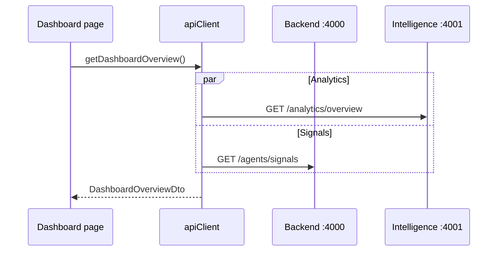

# Frontend API integration

Central client: `lib/api-client.ts`. Requests are split across two services:

| Service | Env | Default |
|---------|-----|---------|
| Jay backend (signals, health) | `NEXT_PUBLIC_API_BASE_URL` | `http://localhost:4000` |
| Kai Zhe intelligence | `NEXT_PUBLIC_INTELLIGENCE_API_URL` | `http://localhost:4001` |

## Environment variables

| Variable | Default | Used for |
|----------|---------|----------|
| `NEXT_PUBLIC_API_BASE_URL` | `http://localhost:4000` | `/agents/signals`, `/health` |
| `NEXT_PUBLIC_INTELLIGENCE_API_URL` | `http://localhost:4001` | Correlation, risk, RAG, analytics, graph |
| `NEXT_PUBLIC_WS_URL` | `ws://localhost:4000/ws` | Backend realtime WebSocket |

Docker Compose passes both URLs via `x-frontend-build-args`.

## Backend (:4000)

| `apiClient` method | HTTP | Path |
|--------------------|------|------|
| `getHealth` | GET | `/health` |
| `getSignals` | GET | `/agents/signals?limit=&signal_type=` |
| `getCyberSignals` | GET | `signal_type=cyber` |
| `getGtmSignals` | GET | `signal_type=gtm` |
| `getVendorSignals` | GET | `signal_type=vendor_risk` |
| `getAlerts` | — | Derived from signals (severity ≥ 6) |

## Intelligence (:4001)

| Method | HTTP | Path | Fallback |
|--------|------|------|----------|
| `getDashboardOverview` | GET | `/analytics/overview` + signals | Signal-only aggregation |
| `getCorrelatedEvents` | GET | `/correlation/events` | `[]` |
| `getRiskScores` | GET | `/risk-scores` | Map from signals |
| `getRiskScoresByType` | GET | `/risk-scores/type/{type}` | Signal map |
| `getTopRisks` | GET | `/analytics/top-risks` | Top mapped scores |
| `getVendorSummary` | GET | `/analytics/vendor-risk-summary` + vendor scores | Vendor signals |
| `askRagQuestion` | POST | `/rag/ask` `{ question }` | Error surfaced in UI |
| `getCyberRiskSummary` | GET | `/analytics/cyber-risk-summary` | `{}` |
| `getMarketMovementSummary` | GET | `/analytics/market-movement-summary` | `{}` |
| `getEntityTimeline` | GET | `/graph/timeline/{entity_id}` | — |
| `getGraphEntities` | GET | `/graph/entities` | — |

## Realtime

`lib/websocket-client.ts` connects to `NEXT_PUBLIC_WS_URL` (`WS /ws` on the Jay backend). The backend tails shared Redis streams and broadcasts `new_signal`, `new_correlated_event`, `new_risk_score`, and `new_alert` events. If the socket does not open within 2.5s, `useRealtimeEvents` falls back to **30s polling**. `RealtimeIndicator` shows `connected` | `polling` | `offline`.

## Request flow

## DTO mapping

- `ApiSignal` → `IntelligenceSignal` via `mapSignal()`
- `ApiRiskScore` → `RiskScore` via `mapRiskScore()`
- `ApiCorrelatedEvent` → `CorrelatedEvent` via `mapCorrelatedEvent()`

Client-side filters: `lib/signal-filters.ts` · Pagination: `lib/pagination.ts`.

## Adding a new integration

1. Confirm route in `sentinelx-intelligence/docs/api-reference.md` or backend docs.
2. Add typed mapper + method on `apiClient`.
3. Document here and in [routes-and-pages.md](routes-and-pages.md).
4. Wire hook + loading/error/empty states on the page.
