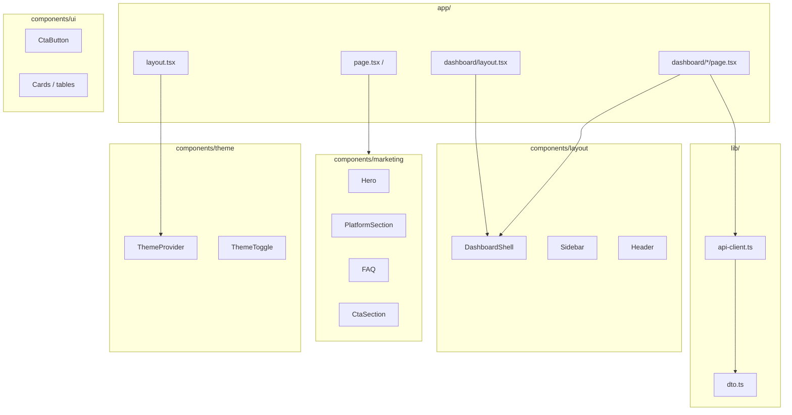
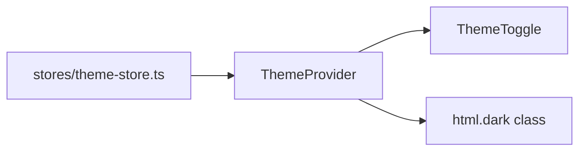

# Frontend architecture

Next.js 15 App Router application with Tailwind CSS v4, client-side data fetching via `lib/api-client.ts`, and Zustand for theme state.

## Component map

## Styling system

| Layer | Location | Notes |
|-------|----------|-------|
| Design tokens | `app/globals.css` | CSS variables, light/dark |
| CTA buttons | `.btn-cta`, `CtaButton` | Explicit colors (avoids `a { color: inherit }` bug) |
| Fonts | `app/layout.tsx` | DM Sans (UI), Source Serif 4 (display) |
| Motion | Framer Motion | Marketing scroll sections |

## State

Server components are used where possible; dashboard pages fetch via `apiClient` in client components or server actions pattern as implemented per page.

## Build & runtime

| Mode | Command | Output |
|------|---------|--------|
| Dev | `npm run dev` | Turbopack, port 3000 |
| Prod | `npm run build` + `node server.js` | `output: 'standalone'` in Docker |
| Env | `NEXT_PUBLIC_*` | Baked at build time for browser calls |

## Docker

Built from `Dockerfile`; exposed as compose service `frontend` on host **4002**.
