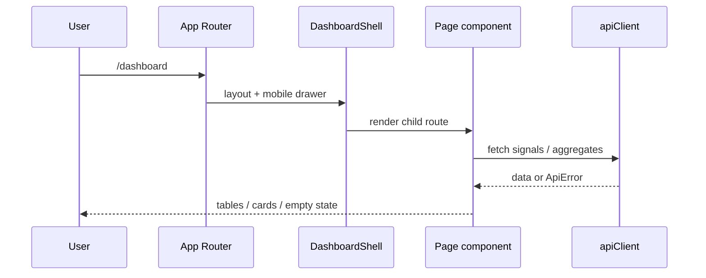
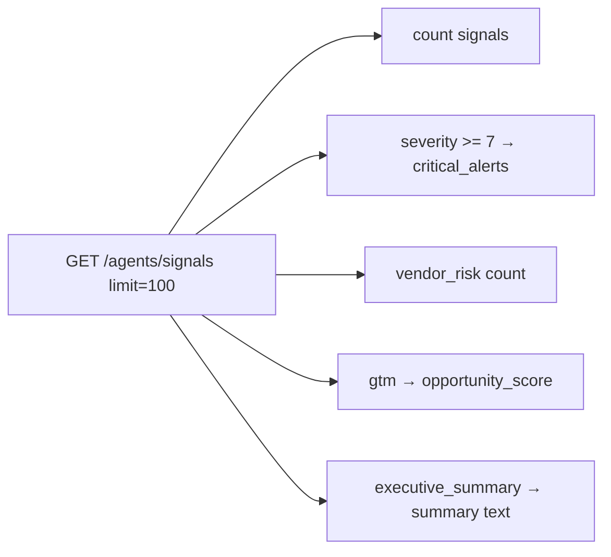
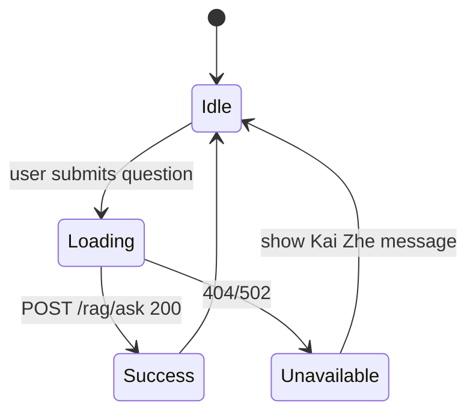
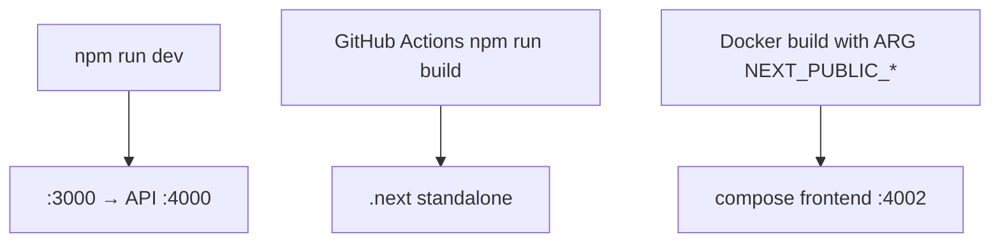

# Frontend workflows

## Marketing site visit

```mermaid
flowchart TD
  A[GET /] --> B[Landing sections]
  B --> C{User action}
  C -->|View platform| D[#platform PlatformSection]
  C -->|Open dashboard| E[/dashboard]
  C -->|Toggle theme| F[ThemeToggle → theme-store]
```

## Dashboard session



## Overview page data derivation

`getDashboardOverview()` does not call a dedicated backend overview endpoint. It derives:



## Intelligence explorer (RAG)



## Theme workflow

```mermaid
flowchart LR
  load[page load] --> read[read theme-store / system]
  read --> apply[set html class dark|light]
  toggle[ThemeToggle click] --> persist[persist preference]
  persist --> apply
```

## Build & deploy workflow



## Error handling convention

Pages should catch `ApiError` and use `getApiErrorMessage()` for display. Empty arrays are valid for list UIs; distinguish “no data yet” vs “service down”.
