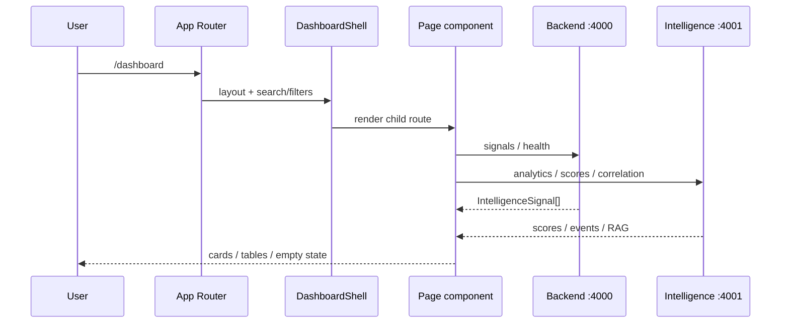
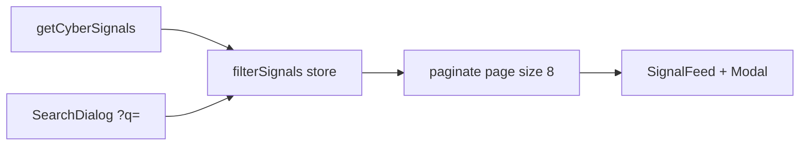
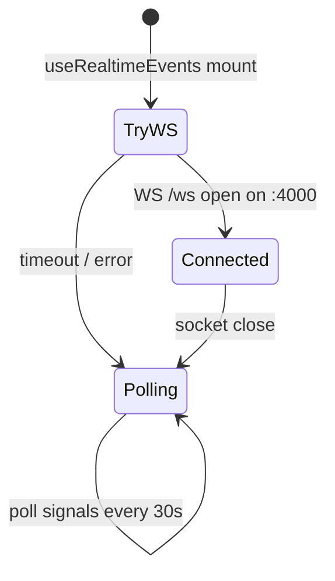
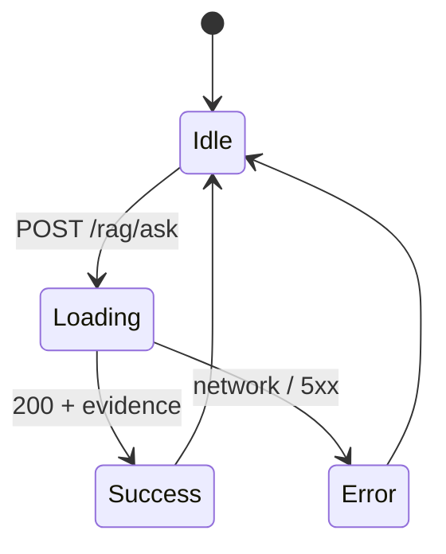
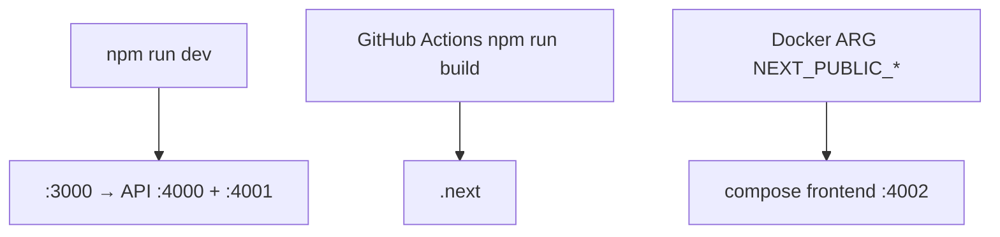

# Frontend workflows

## Marketing site visit

```mermaid
flowchart TD
  A[GET /] --> B[Landing sections]
  B --> C{User action}
  C -->|View platform| D[#platform PlatformSection]
  C -->|Open dashboard| E[/dashboard]
  C -->|Toggle theme| F[ThemeToggle → theme-store]
```

## Dashboard session



## Overview page data

`getDashboardOverview()` prefers `GET /analytics/overview` on the intelligence service, combined with backend signals for summary text and opportunity score. Falls back to signal-only aggregation if intelligence is unreachable.

## Threat feed filters



## Realtime



Backend `realtime_listener` tails Redis streams and pushes JSON to all WebSocket clients.

## Intelligence explorer (RAG)



## Theme workflow

```mermaid
flowchart LR
  load[page load] --> read[read theme-store / system]
  read --> apply[set html class dark|light]
  toggle[ThemeToggle click] --> persist[persist preference]
  persist --> apply
```

## Build & deploy



## Error handling

Catch `ApiError` via `getApiErrorMessage()`. Empty arrays mean “no data yet”; intelligence fallbacks avoid hard failures on list pages except RAG (user-facing error).
