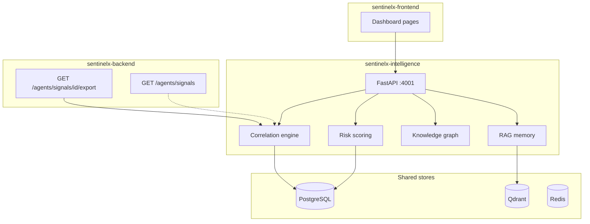

# Intelligence architecture (target)

Planned FastAPI service on port **4001** (compose profile `intelligence`). Consumes Jay's signals and provides correlation, risk scoring, knowledge graph, and RAG.

## Target system context



## Planned modules

| Module | Responsibility |
|--------|----------------|
| Correlation | Cluster signals into events, entity timelines |
| Risk scoring | Entity-level scores by type |
| Knowledge graph | Entities and relationships |
| RAG | Query memory, reindex, entity recall |
| Analytics | Aggregated summaries for dashboard widgets |

## Deployment

```bash
docker compose --profile intelligence up -d --build
```

Until Dockerfile is fully implemented, this profile may remain disabled in production compose defaults.
