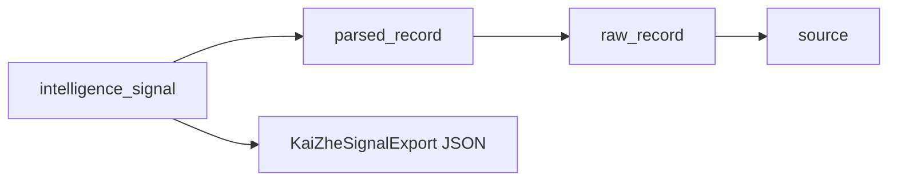

# Backend integration contract

Handoff between Jay (`sentinelx-backend`) and Kai Zhe (`sentinelx-intelligence`).

## Export payload

Jay exposes enriched signal context for downstream processing:

```
GET /agents/signals/{signal_id}/export
→ KaiZheSignalExport
```

Includes parsed record, raw record, and source metadata via SQLAlchemy `joinedload`.



## Recommended consumption pattern

1. Poll or webhook on new `intelligence_signals` (future).
2. Fetch export per signal ID for correlation graph seeding.
3. Store normalized entities in intelligence DB / graph.
4. Expose aggregated views via `/correlation/events` and `/risk-scores`.

## Frontend expectations

| Frontend need | Backend today | Intelligence target |
|---------------|---------------|---------------------|
| Threat / GTM / vendor lists | `GET /agents/signals` | Same (source of truth) |
| Correlation chart | fallback `[]` | `GET /correlation/events` |
| Risk table extras | fallback from signals | `GET /risk-scores` |
| RAG explorer | error message | `POST /rag/ask` |

## Environment

| Service | Compose name | Host port |
|---------|--------------|-----------|
| Backend | `api` | 4000 |
| Intelligence | `intelligence_api` | 4001 |
| Frontend build arg | `NEXT_PUBLIC_INTELLIGENCE_API_URL` | `http://localhost:4001` |

Document breaking changes to export schema in both `sentinelx-backend/docs/api-reference.md` and this file.
