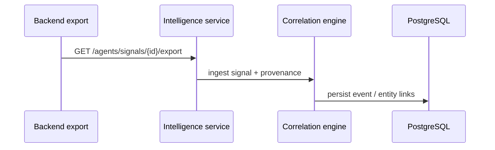
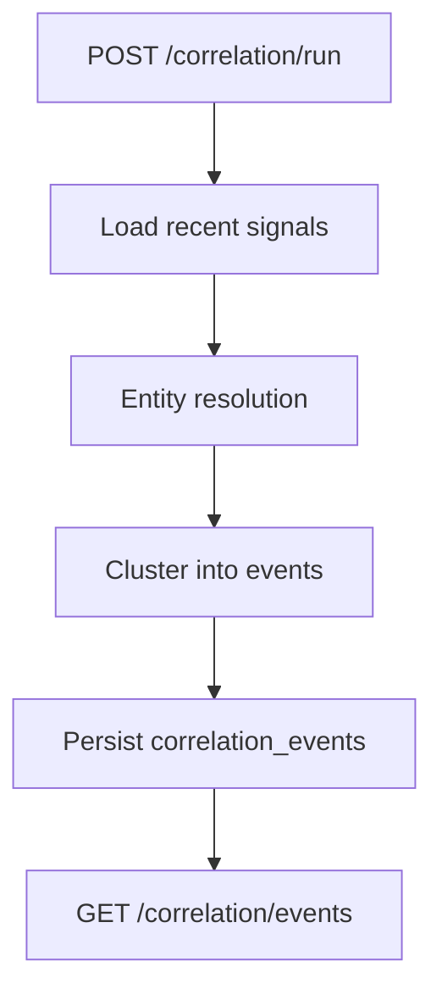
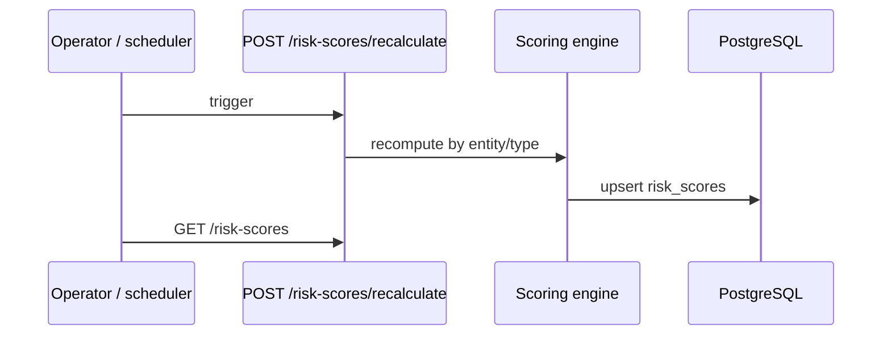
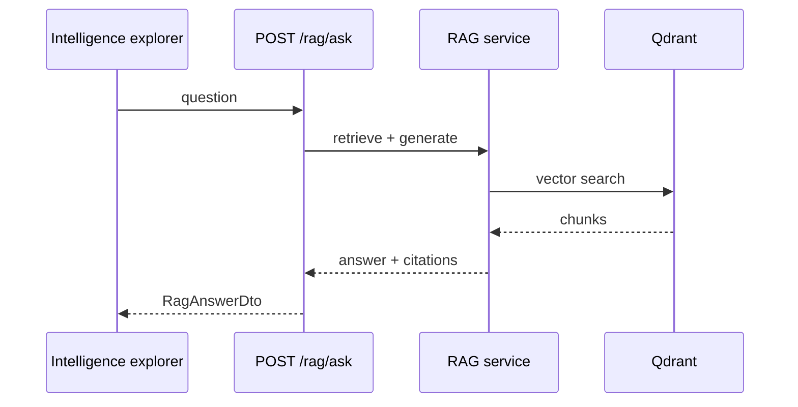
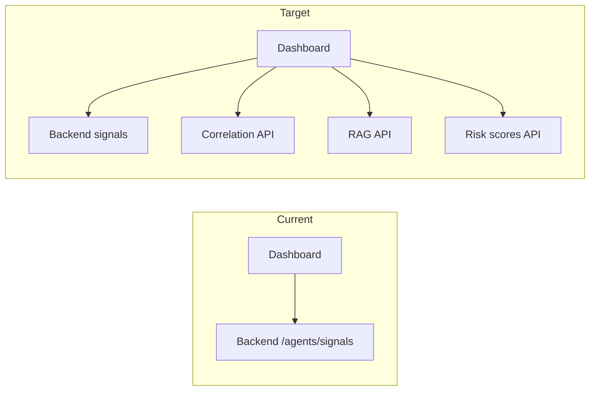

# Intelligence workflows (target)

## Signal ingestion from backend

## Correlation run

## Risk score recalculation

## RAG query

## Frontend integration workflow

Replace “target” diagrams with implemented paths as code lands.
